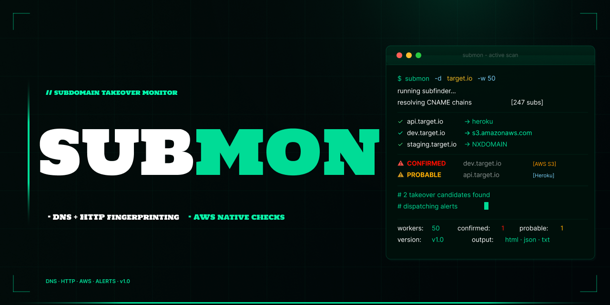

<h1 align="center">
  <br>
  SUBMON
  <br>
</h1>

<h4 align="center">Fast subdomain takeover monitor written in Go</h4>

<p align="center">
  
</p>

<p align="center">
  <a href="#about">About</a> •
  <a href="#features">Features</a> •
  <a href="#installation">Installation</a> •
  <a href="#usage">Usage</a> •
  <a href="#options">Options</a> •
  <a href="#supported-services">Supported Services</a> •
  <a href="#notifications">Notifications</a> •
  <a href="#output">Output</a>
</p>


## About

SUBMON automates the detection of these dangling DNS records at scale. It enumerates subdomains using [subfinder](https://github.com/projectdiscovery/subfinder), resolves CNAME chains, fingerprints HTTP responses against known takeover signatures, and performs native AWS CLI verification for Elastic Beanstalk and S3. Results are reported with a confidence level - `CONFIRMED`, `PROBABLE`, or `POSSIBLE` - so you can triage quickly without chasing false positives.

Built for security researchers, bug bounty hunters, and teams who need to monitor their attack surface continuously.

---

## Features

- **Goroutine worker pool** - 50 workers by default, replaces slow serial scanning
- **25+ service fingerprints** - GitHub Pages, Heroku, Azure, S3, Fastly, Shopify, Zendesk, and more
- **AWS Elastic Beanstalk** - uses `aws elasticbeanstalk check-dns-availability` to confirm claimable CNAME prefixes
- **AWS S3** - uses `aws s3api head-bucket` + HTTP `NoSuchBucket` probe
- **NXDOMAIN detection** - catches dangling CNAME targets with no DNS resolution
- **HTML report** - dark theme, filterable findings table, confidence badges
- **JSON + text reports** - machine-readable output for automation
- **Telegram and Discord alerts** - real-time notifications on findings
- **First-run interactive setup** - guided notification configuration on first launch
- **Daemon mode** - continuous monitoring at a set interval with `--vps`

---

## Installation

```sh
go install github.com/unluckyhacker/submon@latest
```

Or build from source:

```sh
git clone https://github.com/unluckyhacker/submon
cd submon
go build -o submon .
```

---

## Usage

```sh
# Basic scan
./submon -d example.com

# Fast scan with more workers
./submon -d example.com -w 100

# Scan a list of domains
./submon -l domains.txt -c 5

# Use baddns alongside built-in checks
./submon -d example.com --scan-mode all

# HTML report only
./submon -d example.com -o html

# Only show confirmed findings
./submon -d example.com --confidence confirmed

# AWS checks in a specific region
./submon -d example.com --aws-region eu-west-1

# Daemon mode - repeat every 24 hours
./submon -d example.com --vps 24
```

---

## Options

| Flag | Description | Default |
|------|-------------|---------|
| `-d <domain>` | Target domain | - |
| `-l <file>` | Domain list (one per line) | - |
| `-w <n>` | Worker count | `50` |
| `-c <n>` | Concurrent domain scans (with `-l`) | `1` |
| `-depth <n>` | Subdomain depth (0=all, 1=`*.domain`, 2=`*.*.domain`) | `1` |
| `-o <format>` | Output format: `all`, `json`, `html`, `text` | `all` |
| `-confidence <lvl>` | Filter findings: `all`, `confirmed`, `probable` | `all` |
| `-scan-mode <mode>` | Scanner: `builtin`, `baddns`, `all` | `builtin` |
| `-timeout <sec>` | Per-subdomain timeout in seconds | `10` |
| `-aws-region <r>` | AWS region for Elastic Beanstalk checks | `us-east-1` |
| `-vps <hours>` | Daemon mode interval in hours | - |
| `-q` | Quiet mode | - |

---

## Scan Modes

| Mode | Description |
|------|-------------|
| `builtin` | Built-in DNS + HTTP fingerprinting (default, no extra tools required) |
| `baddns` | Use baddns tool only |
| `all` | Both builtin and baddns combined |

---

## Supported Services

| Service | Detection Method |
|---------|-----------------|
| AWS Elastic Beanstalk | CNAME match + CLI availability check |
| AWS S3 | CNAME match + `head-bucket` + HTTP probe |
| AWS CloudFront | CNAME match + NXDOMAIN detection |
| GitHub Pages | CNAME match + HTTP body fingerprint |
| Heroku | CNAME match + HTTP body fingerprint |
| Azure App Service | CNAME match + HTTP body fingerprint |
| Fastly | CNAME match + HTTP body fingerprint |
| Shopify | CNAME match + HTTP body fingerprint |
| Tumblr | CNAME match + HTTP body fingerprint |
| Ghost | CNAME match + HTTP body fingerprint |
| Webflow | CNAME match + HTTP body fingerprint |
| Surge.sh | CNAME match + HTTP body fingerprint |
| Bitbucket | CNAME match + HTTP body fingerprint |
| Zendesk | CNAME match + HTTP body fingerprint |
| UserVoice | CNAME match + HTTP body fingerprint |
| Intercom | CNAME match + HTTP body fingerprint |
| HelpJuice | CNAME match + HTTP body fingerprint |
| HelpScout | CNAME match + HTTP body fingerprint |
| Readme.io | CNAME match + HTTP body fingerprint |
| Pingdom | CNAME match + HTTP body fingerprint |
| BigCartel | CNAME match + HTTP body fingerprint |
| Pantheon | CNAME match + HTTP body fingerprint |
| Launchrock | CNAME match + HTTP body fingerprint |
| Kajabi | CNAME match + HTTP body fingerprint |
| Strikingly | CNAME match + HTTP body fingerprint |

---

## Notifications

On first run, SUBMON prompts you to configure Telegram and Discord alerts. Credentials are saved to `~/.config/submon/config.json`.

To reconfigure, delete the config file and run again:

```sh
rm ~/.config/submon/config.json
./submon -d example.com
```

You can also set credentials via environment variables (these override the saved config):

```sh
export TELEGRAM_ENABLED=true
export TELEGRAM_BOT_TOKEN=your_token
export TELEGRAM_CHAT_ID=your_chat_id

export DISCORD_ENABLED=true
export DISCORD_WEBHOOK_URL=https://discord.com/api/webhooks/...
```

---

## Output

Results are saved to `results/<domain>/<timestamp>/`:

```
results/example.com/20250403_120000/
├── report.html                - HTML report (dark theme, filterable)
├── report.json                - Machine-readable JSON
├── summary.txt                - Text summary
├── findings.json              - Raw findings
├── vulnerable_confirmed.txt
├── vulnerable_probable.txt
├── vulnerable_all.txt
└── subdomains.txt
```

### Confidence Levels

| Level | Meaning |
|-------|---------|
| `CONFIRMED` | AWS CLI verified or NXDOMAIN on CNAME target |
| `PROBABLE` | HTTP body fingerprint matched, no CLI confirmation |
| `POSSIBLE` | Partial CNAME match only |

---

## License

MIT
